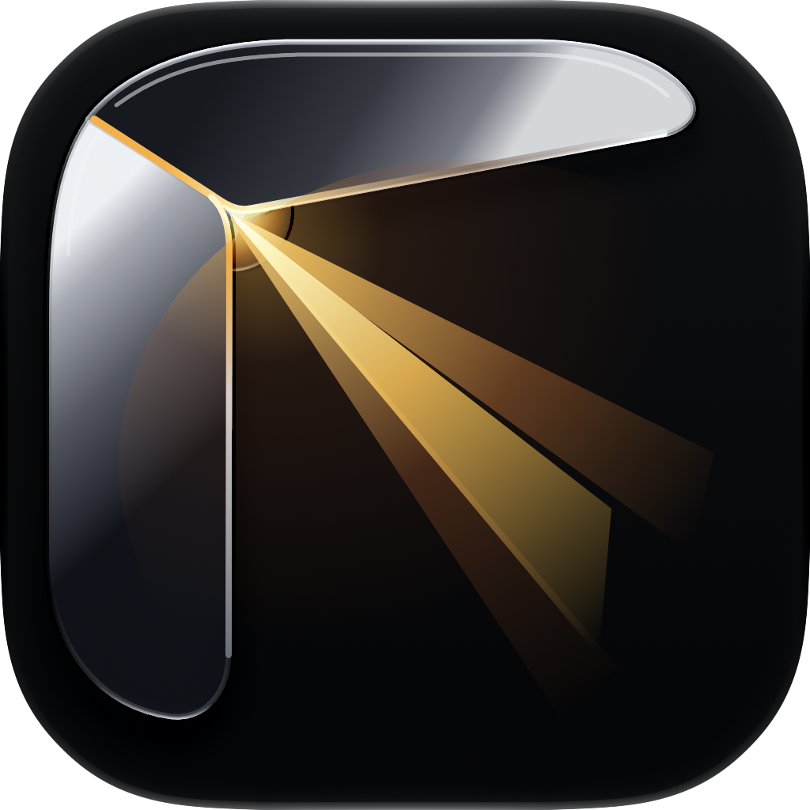

# Cornerlight



Cornerlight is a small, index-free macOS application launcher. It reads application bundles directly from `/Applications`, `/System/Applications`, and `~/Applications`, then presents that inventory through macOS’s native launcher interface.

**Your apps, directly.**

[Website](https://emrikol.github.io/Cornerlight/) · [Releases](https://github.com/emrikol/Cornerlight/releases)

## Features

- No Spotlight metadata index, app database, polling, telemetry, or advertising.
- Background catalog refresh only when the application folders change.
- Native macOS search, keyboard navigation, animation, scrolling, and launch behavior.
- Configurable unassigned Hot Corner.
- Pinned, recent, and hidden applications.
- Optional Launch at Login and signed Sparkle updates.

Cornerlight is a personal macOS 26.6 project. It relies on private, version-specific system implementation details and may stop working after a macOS update.

## Install

Download the latest signed and notarized DMG from [Releases](https://github.com/emrikol/Cornerlight/releases), move Cornerlight to Applications, and open it once.

The chosen corner must be set to **None** (`—`) in **System Settings → Desktop & Dock → Hot Corners**. Cornerlight Settings offers only currently unassigned corners.

macOS requests Input Monitoring because the native nonactivating launcher panel uses a mouse-only event tap to dismiss itself when you click elsewhere. Cornerlight does not monitor system-wide keystrokes.

## Use

- Move the pointer into the configured corner.
- Type to filter applications.
- Press Return or click an application to open it.
- Right-click applications to pin, unpin, hide, or reveal them.
- Drag pinned applications within the top row to reorder them.
- Press Escape, click elsewhere, or re-enter the corner to dismiss.

Cornerlight is intended to replace the stock Spotlight Applications launcher. Running both launchers concurrently can produce conflicting macOS focus restoration.

## Build

Building requires macOS 26.6 and Xcode 26.6.

```sh
./build.sh --allow-adhoc
./verify.sh
```

Ad-hoc builds may require privacy permission again after rebuilding. Published releases use a stable Developer ID signature.

## Privacy

See [PRIVACY.md](PRIVACY.md) for the data and network policy.

## License

Cornerlight is licensed under the [GNU General Public License v3.0](LICENSE). Dependency and font notices are in [THIRD_PARTY_NOTICES.md](THIRD_PARTY_NOTICES.md).

## Support

Cornerlight is provided as-is, without support or warranty. Issues are disabled and pull requests are limited to existing repository collaborators. You may fork and adapt the project under GPL-3.0; modified distributions should use different branding.
